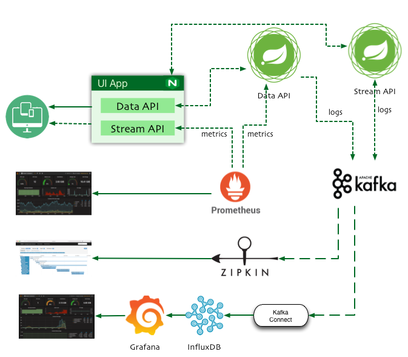
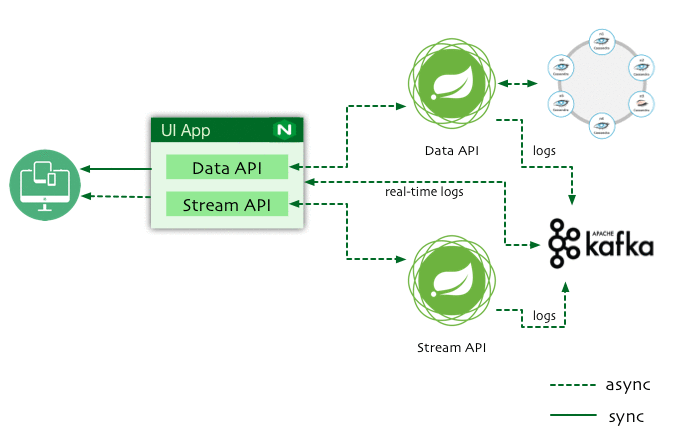

[](https://travis-ci.org/xmlking/microservices-observability)
[](https://codecov.io/github/xmlking/microservices-observability?branch=master)
[](https://github.com/xmlking/microservices-observability/blob/master/LICENSE)
[](https://gitter.im/xmlking/microservices-observability?utm_source=badge&utm_medium=badge&utm_campaign=pr-badge&utm_content=badge)

microservices-observability
===========================
As Developers are migrating from **Monolithic** architecture to distributed **microservices** and **Service Mesh**, troubleshooting production issues become difficult.

This sample application showcases patterns to implement better **Observability** at web scale.



#### Log Aggregation 



#### Highlights
* Ready to go docker configuration for set up **GILK** logging stack in a minutes.
    * **GILK** - **G**rafana , **I**nfluxDB, **L**ogstash json format, **K**afka
* Monitoring solution for docker hosts and containers with [Prometheus](https://prometheus.io/), [Grafana](http://grafana.org/), [cAdvisor](https://github.com/google/cadvisor), 
[NodeExporter](https://github.com/prometheus/node_exporter) and alerting with [AlertManager](https://github.com/prometheus/alertmanager).
* Vendor-neutral instrumentation
    * Log Aggregation - SLF4J
    * Distributed Tracking - [OpenTracing](http://opentracing.io/)
    * Application Metrics - [MicroMeter](http://micrometer.io/)
* end-to-end `Functional Reactive Programming (FRP)` with Spring 5.
* Multi-project builds with Gradle Kotlin Script. 
* Spring [Kotlin Support](https://docs.spring.io/spring-framework/docs/5.0.x/spring-framework-reference/kotlin.html)
* Docker deployment

### Prerequisites
1. Gradle 4.4 (Install via [sdkman](http://sdkman.io/))
2. Docker for Mac [Setup Instructions](./docs/docker.md)

### Build
```bash
# build all 3 executable jars
gradle build
# continuous build with `-t`. 
# this shoud be started before any run tasks i.e., `gradle ui-app:bootRun`, for spring's devtools to work.
gradle build -x test -t
# build all 3 apps
gradle build -x test
# build all 3 docker images
gradle docker -x test
```

### Test
```bash
gradle test
```

### Run
##### Manual 
```bash
# start infra services
docker-compose  -f docker-compose-infra.yml up cassandra
docker-compose  -f docker-compose-infra.yml up kafka
docker-compose  -f docker-compose-infra.yml up influxdb
```
Start all 4 apps with `gradle xyz:bootRun` : [cassandra-data-service](./cassandra-data-service/), [stream-service](./stream-service/), [ui-app](./ui-app/) , [kafka-influxdb-service](./kafka-influxdb-service/)
> If you want to debug the app, add --debug-jvm parameter to Gradle command line

##### Docker
You can also build Docker images and run all via `Docker Compose`
```bash
# start containers in the background
docker-compose up -d
# start containers in the foreground
docker-compose up 
# show runnning containers 
docker-compose ps
# scaling containers and load balancing
docker-compose scale stream=2
# 1. stop the running containers using
docker-compose stop
# 2. remove the stopped containers using
docker-compose rm -f
# just start only infra services
docker-compose  -f docker-compose-infra.yml up
# connect(ssh) to a service and run a command
docker-compose exec cassandra cqlsh
# see logs of a service 
docker-compose logs -f stream
# restart single service
docker-compose restart stream
# start single service
docker-compose -f docker-compose-infra.yml up cassandra
docker-compose -f docker-compose-infra.yml up kafka
docker-compose -f docker-compose-infra.yml up influxdb
# check health for a service
docker inspect --format "{{json .State.Health.Status }}" microservicesobservability_app_1
docker ps
```
> Access UI App at http://localhost:8080

> Prometheus http://localhost:9090/graph

> InfluxDB http://localhost:8083

> Grafana http://localhost:1634

### Gradle Commands
```bash
# upgrade project gradle version
gradle wrapper --gradle-version 4.3 --distribution-type all
gradle wrapper --gradle-version 4.4-rc-1 --distribution-type all
# gradle daemon status 
gradle --status
gradle --stop
# refresh dependencies
gradle build --refresh-dependencies
```

### Reference 
* Reactive Spring and Kotlin-based Application
    * https://github.com/johnsonr/flux-flix-service
